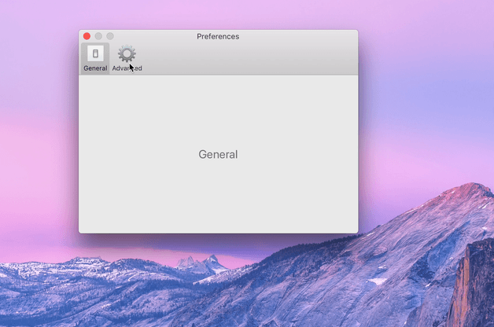
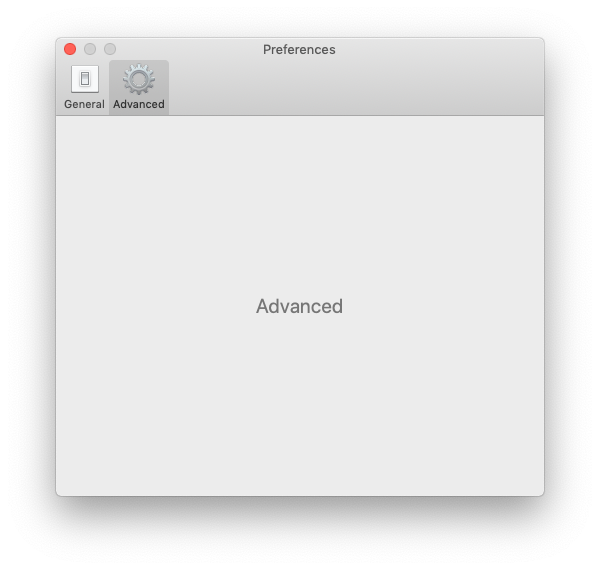
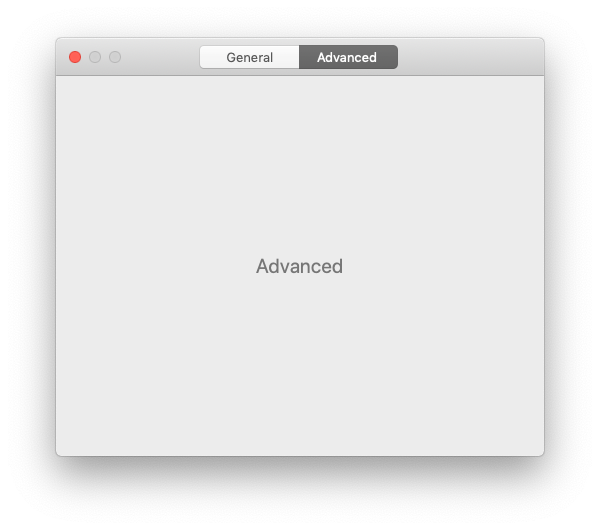

# Preferences

> Add a preferences window to your macOS app in minutes



Just pass in some view controllers and this package will take care of the rest. Built-in SwiftUI support.

<br>

---

<div align="center">
	<p>
		<p>
			<sup>
				<a href="https://github.com/sponsors/sindresorhus">Sindre‘s open source work is supported by the community</a>
			</sup>
		</p>
		<sup>Special thanks to:</sup>
		<br>
		<br>
		<a href="https://keygen.sh">
			<div>
				
			</div>
			<b>A dead-simple software licensing and distribution API built for developers</b>
		</a>
		<br>
		<br>
	</p>
</div>

---

<br>

## Requirements

- macOS 10.10+
- Xcode 12.5+
- Swift 5.4+

## Install

#### Swift Package Manager

Add `https://github.com/sindresorhus/Preferences` in the [“Swift Package Manager” tab in Xcode](https://developer.apple.com/documentation/xcode/adding_package_dependencies_to_your_app).

#### Carthage

```
github "sindresorhus/Preferences"
```

#### CocoaPods

```ruby
pod 'Preferences'
```

## Usage

*Run the `PreferencesExample` target in Xcode to try a live example (requires macOS 11 or later).*

First, create some preference pane identifiers:

```swift
import Preferences

extension Preferences.PaneIdentifier {
	static let general = Self("general")
	static let advanced = Self("advanced")
}
```

Second, create a couple of view controllers for the preference panes you want. The only difference from implementing a normal view controller is that you have to add the `PreferencePane` protocol and implement the `preferencePaneIdentifier`, `toolbarItemTitle`, and `toolbarItemIcon` properties, as shown below. You can leave out `toolbarItemIcon` if you're using the `.segmentedControl` style.

`GeneralPreferenceViewController.swift`

```swift
import Cocoa
import Preferences

final class GeneralPreferenceViewController: NSViewController, PreferencePane {
	let preferencePaneIdentifier = Preferences.PaneIdentifier.general
	let preferencePaneTitle = "General"
	let toolbarItemIcon = NSImage(systemSymbolName: "gearshape", accessibilityDescription: "General preferences")!

	override var nibName: NSNib.Name? { "GeneralPreferenceViewController" }

	override func viewDidLoad() {
		super.viewDidLoad()

		// Setup stuff here
	}
}
```

Note: If you need to support macOS versions older than macOS 11, you have to add a [fallback for the `toolbarItemIcon`](#backwards-compatibility).

`AdvancedPreferenceViewController.swift`

```swift
import Cocoa
import Preferences

final class AdvancedPreferenceViewController: NSViewController, PreferencePane {
	let preferencePaneIdentifier = Preferences.PaneIdentifier.advanced
	let preferencePaneTitle = "Advanced"
	let toolbarItemIcon = NSImage(systemSymbolName: "gearshape.2", accessibilityDescription: "Advanced preferences")!

	override var nibName: NSNib.Name? { "AdvancedPreferenceViewController" }

	override func viewDidLoad() {
		super.viewDidLoad()

		// Setup stuff here
	}
}
```

If you need to respond actions indirectly, `PreferencesWindowController` will forward responder chain actions to the active pane if it responds to that selector.

```swift
final class AdvancedPreferenceViewController: NSViewController, PreferencePane {
	@IBOutlet private var fontLabel: NSTextField!
	private var selectedFont = NSFont.systemFont(ofSize: 14)

	@IBAction private func changeFont(_ sender: NSFontManager) {
		font = sender.convert(font)
	}
}
```

In the `AppDelegate`, initialize a new `PreferencesWindowController` and pass it the view controllers. Then add an action outlet for the `Preferences…` menu item to show the preferences window.

`AppDelegate.swift`

```swift
import Cocoa
import Preferences

@main
final class AppDelegate: NSObject, NSApplicationDelegate {
	@IBOutlet private var window: NSWindow!

	private lazy var preferencesWindowController = PreferencesWindowController(
		preferencePanes: [
			GeneralPreferenceViewController(),
			AdvancedPreferenceViewController()
		]
	)

	func applicationDidFinishLaunching(_ notification: Notification) {}

	@IBAction
	func preferencesMenuItemActionHandler(_ sender: NSMenuItem) {
		preferencesWindowController.show()
	}
}
```

### Preferences Tab Styles

When you create the `PreferencesWindowController`, you can choose between the `NSToolbarItem`-based style (default) and the `NSSegmentedControl`:

```swift
// …
private lazy var preferencesWindowController = PreferencesWindowController(
	preferencePanes: [
		GeneralPreferenceViewController(),
		AdvancedPreferenceViewController()
	],
	style: .segmentedControl
)
// …
```

`.toolbarItem` style:



`.segmentedControl` style:



## API

```swift
public enum Preferences {}

extension Preferences {
	public enum Style {
		case toolbarItems
		case segmentedControl
	}
}

public protocol PreferencePane: NSViewController {
	var preferencePaneIdentifier: Preferences.PaneIdentifier { get }
	var preferencePaneTitle: String { get }
	var toolbarItemIcon: NSImage { get } // Not required when using the .`segmentedControl` style
}

public final class PreferencesWindowController: NSWindowController {
	init(
		preferencePanes: [PreferencePane],
		style: Preferences.Style = .toolbarItems,
		animated: Bool = true,
		hidesToolbarForSingleItem: Bool = true
	)

	init(
		panes: [PreferencePaneConvertible],
		style: Preferences.Style = .toolbarItems,
		animated: Bool = true,
		hidesToolbarForSingleItem: Bool = true
	)

	func show(preferencePane: Preferences.PaneIdentifier? = nil)
}
```

As with any `NSWindowController`, call `NSWindowController#close()` to close the preferences window.

## Recommendation

The easiest way to create the user interface within each pane is to use a [`NSGridView`](https://developer.apple.com/documentation/appkit/nsgridview) in Interface Builder. See the example project in this repo for a demo.

## SwiftUI support

If your deployment target is macOS 10.15 or later, you can use the bundled SwiftUI components to create panes. Create a
`Preferences.Pane` (instead of `PreferencePane` when using AppKit) using your custom view and necessary toolbar information.

Run the `PreferencesExample` target in the Xcode project in this repo to see a real-world example. The `Accounts` tab is in SwiftUI.

There are also some bundled convenience SwiftUI components, like [`Preferences.Container`](./Sources/PreferencesSwiftUI/PreferenceContainer.swift) and [`Preferences.Section`](./Sources/PreferencesSwiftUI/PreferenceSection.swift) to automatically achieve similar alignment to AppKit's [`NSGridView`](https://developer.apple.com/documentation/appkit/nsgridview). And also a `.preferenceDescription()` view modifier to style text as a preference description.

Tip: The [`Defaults`](https://github.com/sindresorhus/Defaults#swiftui-support) package makes it very easy to persist the preferences.

```swift
struct CustomPane: View {
	var body: some View {
		Preferences.Container(contentWidth: 450.0) {
			Preferences.Section(title: "Section Title") {
				// Some view.
			}
			Preferences.Section(label: {
				// Custom label aligned on the right side.
			}) {
				// Some view.
			}
			…
		}
	}
}
```

Then in the `AppDelegate`, initialize a new `PreferencesWindowController` and pass it the pane views.

```swift
// …

private lazy var preferencesWindowController = PreferencesWindowController(
	panes: [
		Pane(
			 identifier: …,
			 title: …,
			 toolbarIcon: NSImage(…)
		) {
			CustomPane()
		},
		Pane(
			 identifier: …,
			 title: …,
			 toolbarIcon: NSImage(…)
		) {
			AnotherCustomPane()
		}
	]
)

// …
```

If you want to use SwiftUI panes alongside standard AppKit `NSViewController`'s, instead wrap the pane views into `Preferences.PaneHostingController` and pass them to `PreferencesWindowController` as you would with standard panes.

```swift
let CustomViewPreferencePaneViewController: () -> PreferencePane = {
	let paneView = Preferences.Pane(
		identifier: …,
		title: …,
		toolbarIcon: NSImage(…)
	) {
		// Your custom view (and modifiers if needed).
		CustomPane()
		//  .environmentObject(someSettingsManager)
	}

	return Preferences.PaneHostingController(paneView: paneView)
}

// …

private lazy var preferencesWindowController = PreferencesWindowController(
	preferencePanes: [
		GeneralPreferenceViewController(),
		AdvancedPreferenceViewController(),
		CustomViewPreferencePaneViewController()
	],
	style: .segmentedControl
)

// …
```

[Full example here.](Example/AccountsView.swift).

## Backwards compatibility

macOS 11 and later supports SF Symbols which can be conveniently used for the toolbar icons. If you need to support older macOS versions, you have to add a fallback. Apple recommends using the same icons even for older systems. The best way to achieve this is to [export the relevant SF Symbols icons](https://github.com/davedelong/sfsymbols) to images and add them to your Asset Catalog.

## Known issues

### The preferences window doesn't show

This can happen when you are not using auto-layout or have not set a size for the view controller. You can fix this by either using auto-layout or setting an explicit size, for example, `preferredContentSize` in `viewDidLoad()`. [We intend to fix this.](https://github.com/sindresorhus/Preferences/pull/28)

### There are no animations on macOS 10.13 and earlier

The `animated` parameter of `PreferencesWindowController.init` has no effect on macOS 10.13 or earlier as those versions don't support `NSViewController.TransitionOptions.crossfade`.

## FAQ

### How can I localize the window title?

The `PreferencesWindowController` adheres to the [macOS Human Interface Guidelines](https://developer.apple.com/design/human-interface-guidelines/macos/app-architecture/preferences/) and uses this set of rules to determine the window title:

- **Multiple preference panes:** Uses the currently selected `preferencePaneTitle` as the window title. Localize your `preferencePaneTitle`s to get localized window titles.
- **Single preference pane:** Sets the window title to `APPNAME Preferences`. The app name is obtained from your app's bundle. You can localize its `Info.plist` to customize the title. The `Preferences` part is taken from the "Preferences…" menu item, see #12. The order of lookup for the app name from your bundle:
	1. `CFBundleDisplayName`
	2. `CFBundleName`
	3. `CFBundleExecutable`
	4. Fall back to `"<Unknown App Name>"` to show you're missing some settings.

### Why should I use this instead of just manually implementing it myself?

It can't be that hard right? Well, turns out it is:

- The recommended way is to implement it using storyboards. [But storyboards...](https://gist.github.com/iraycd/01b45c5e1be7ef6957b7) And if you want the segmented control style, you have to implement it programmatically, [which is quite complex](https://github.com/sindresorhus/Preferences/blob/85f8d793050004fc0154c7f6a061412e00d13fa3/Sources/Preferences/SegmentedControlStyleViewController.swift).
- [Even Apple gets it wrong, a lot.](https://twitter.com/sindresorhus/status/1113382212584464384)
- You have to correctly handle [window](https://github.com/sindresorhus/Preferences/commit/cc25d58a9ec379812fc8f2fd7ba48f3d35b4cbff) and [tab restoration](https://github.com/sindresorhus/Preferences/commit/2bb3fc7418f3dc49b534fab986807c4e70ba78c3).
- [The window title format depends on whether you have a single or multiple panes.](https://developer.apple.com/design/human-interface-guidelines/macos/app-architecture/preferences/)
- It's difficult to get the transition animation right. A lot of apps have flaky animation between panes.
- You end up having to deal with a lot of gnarly auto-layout complexities.

### How is it better than [`MASPreferences`](https://github.com/shpakovski/MASPreferences)?

- Written in Swift. *(No bridging header!)*
- Swifty API using a protocol.
- Supports segmented control style tabs.
- SwiftUI support.
- Fully documented.
- Adheres to the [macOS Human Interface Guidelines](https://developer.apple.com/design/human-interface-guidelines/macos/app-architecture/preferences/).
- The window title is automatically localized by using the system string.

## Related

- [Defaults](https://github.com/sindresorhus/Defaults) - Swifty and modern UserDefaults
- [LaunchAtLogin](https://github.com/sindresorhus/LaunchAtLogin) - Add "Launch at Login" functionality to your macOS app
- [KeyboardShortcuts](https://github.com/sindresorhus/KeyboardShortcuts) - Add user-customizable global keyboard shortcuts to your macOS app
- [DockProgress](https://github.com/sindresorhus/DockProgress) - Show progress in your app's Dock icon
- [Regex](https://github.com/sindresorhus/Regex) - Swifty regular expressions
- [More…](https://github.com/search?q=user%3Asindresorhus+language%3Aswift)

You might also like Sindre's [apps](https://sindresorhus.com/apps).

## Used in these apps

- [TableFlip](https://tableflipapp.com) - Visual Markdown table editor by [Christian Tietze](https://github.com/DivineDominion)
- [The Archive](https://zettelkasten.de/the-archive/) - Note-taking app by [Christian Tietze](https://github.com/DivineDominion)
- [Word Counter](https://wordcounterapp.com) - Measuring writer's productivity by [Christian Tietze](https://github.com/DivineDominion)

Want to tell the world about your app that is using Preferences? Open a PR!

## Maintainers

- [Sindre Sorhus](https://github.com/sindresorhus)
- [Christian Tietze](https://github.com/DivineDominion)
